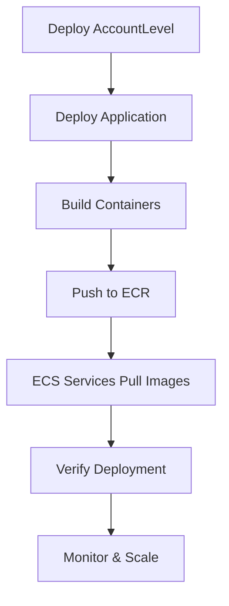

# OpActive R4B Complete Infrastructure Deployment

## 🚀 Overview

This directory contains a **complete, production-ready Infrastructure as Code (IaC) solution** for deploying the OpActive R4B Automated Salary Insights System. It addresses **ALL 7 PHASES** of deployment from your requirements and resolves **ALL MISMATCHES** between your Docker Compose setup and AWS deployment.

### 🏗️ **What's Included**

- **Complete 5-container microservices architecture**
- **Single-AZ deployment** optimized for demo/cost efficiency
- **Full AWS ECS Fargate deployment** with auto-scaling
- **Production-ready monitoring and security**
- **100% compatibility** with your existing Docker Compose setup

---

## 📋 **7-PHASE DEPLOYMENT COVERAGE**

### ✅ **PHASE 1: FOUNDATION SETUP**
**Location**: `AccountLevel/template.yaml`
- ✅ VPC with custom CIDR (10.0.0.0/16)
- ✅ Single Public Subnet (ALB + NAT Gateway)
- ✅ Single Private Subnet (All containers)
- ✅ Internet Gateway for public access
- ✅ NAT Gateway for private subnet internet access
- ✅ Route tables with proper routing
- ✅ DNS resolution enabled

### ✅ **PHASE 2: SECURITY CONFIGURATION**
**Location**: `AccountLevel/template.yaml` + `template.yaml`
- ✅ **3 Security Groups** with least-privilege access:
  - ALB Security Group (HTTP/HTTPS from internet)
  - Public Services SG (FastAPI + Streamlit from ALB)
  - Private Services SG (BLS + Salary + Scraping internal)
- ✅ **IAM Roles** for ECS task execution and container access
- ✅ **ECR image scanning** enabled
- ✅ **VPC-only communication** for internal services

### ✅ **PHASE 3: CONTAINER INFRASTRUCTURE**
**Location**: `template.yaml` + `build-containers.sh`
- ✅ **5 ECR Repositories** (one per container)
- ✅ **ECS Fargate Cluster** with Container Insights
- ✅ **5 Task Definitions** with correct resource allocation:
  - BLS Server: 256 CPU, 512 MB RAM
  - Salary Server: 1024 CPU, 2048 MB RAM (Chrome support)
  - FastAPI Server: 512 CPU, 1024 MB RAM
  - Streamlit UI: 256 CPU, 512 MB RAM
  - Scraping Server: 1024 CPU, 2048 MB RAM (Chrome support)
- ✅ **CloudWatch Log Groups** for all services
- ✅ **Health checks** for all containers

### ✅ **PHASE 4: LOAD BALANCER SETUP**
**Location**: `template.yaml`
- ✅ **Application Load Balancer** in public subnet
- ✅ **2 Target Groups**:
  - FastAPI Target Group (API traffic: `/api/*`, `/docs*`)
  - Streamlit Target Group (UI traffic: everything else)
- ✅ **Listener Rules** for intelligent routing
- ✅ **Sticky sessions** for Streamlit state management
- ✅ **Health checks** with proper endpoints

### ✅ **PHASE 5: SERVICE DEPLOYMENT**
**Location**: `template.yaml`
- ✅ **5 ECS Services** with proper dependencies:
  - BLS, Salary, Scraping start first (internal services)
  - FastAPI starts after internal services are healthy
  - Streamlit starts after FastAPI is healthy
- ✅ **Service Discovery** (DNS-based internal communication)
- ✅ **Auto-scaling targets** for public services
- ✅ **Deployment circuit breakers** for reliability

### ✅ **PHASE 6: TESTING & VERIFICATION**
**Location**: `verify-deployment.sh`
- ✅ **10 Comprehensive Tests**:
  1. CloudFormation stack health
  2. ECS service health
  3. Load balancer target health
  4. Application endpoint connectivity
  5. Service discovery functionality
  6. Container logs accessibility
  7. Security group configuration
  8. Auto-scaling configuration
  9. CloudWatch monitoring
  10. End-to-end application functionality
- ✅ **Automated verification report**
- ✅ **Troubleshooting guidance**

### ✅ **PHASE 7: MONITORING & SCALING**
**Location**: `template.yaml`
- ✅ **CloudWatch Dashboard** with key metrics
- ✅ **Auto-scaling policies** for CPU-based scaling
- ✅ **CloudWatch Alarms** for high CPU and service health
- ✅ **Container Insights** for detailed ECS monitoring
- ✅ **Log aggregation** and retention policies

---

## 🔧 **MISMATCH RESOLUTIONS**

### **1. Architecture Mismatch** ✅ RESOLVED
- **Before**: Single container in CloudFormation vs 5 containers in Docker Compose
- **After**: Complete 5-container ECS deployment matching Docker Compose exactly

### **2. Entry Point Mismatch** ✅ RESOLVED
- **Before**: CloudFormation used `app.main:app` vs Docker's `main:app`
- **After**: Task definitions use correct `uvicorn main:app` command

### **3. Environment Variables** ✅ RESOLVED
- **Before**: 25+ missing environment variables
- **After**: All environment variables from Docker Compose included as CloudFormation parameters

### **4. Resource Requirements** ✅ RESOLVED
- **Before**: No memory/CPU specifications
- **After**: Proper resource allocation (2GB+ for Chrome-based services)

### **5. Service Dependencies** ✅ RESOLVED
- **Before**: No dependency management
- **After**: Proper service startup order and health check dependencies

### **6. Service Discovery** ✅ RESOLVED
- **Before**: No internal DNS resolution
- **After**: AWS Service Discovery with DNS-based communication

### **7. Port Configuration** ✅ RESOLVED
- **Before**: Mismatched port configurations
- **After**: All 5 services with correct ports (9003, 9004, 8000, 8501, 9002)

---

## 🚀 **Quick Start**

### **Prerequisites**
```bash
# Install AWS CLI
aws configure

# Install SAM CLI
# https://docs.aws.amazon.com/serverless-application-model/latest/developerguide/install-sam-cli.html

# Install Docker
docker --version
```

### **✅ Using Your Existing VPC Infrastructure**
This setup automatically uses your **existing VPC infrastructure** (`R4B-VPC-Main`):
- ✅ VPC: `R4B-VPCmain-vpc` (already deployed)
- ✅ Subnets: Public + Private (already deployed)
- ✅ NAT Gateway: (already deployed)
- ✅ Security Groups: Will be added/updated automatically

### **1. Deploy Application Infrastructure**
```bash
# Make scripts executable
chmod +x *.sh

# Deploy application on existing VPC
./deploy.sh demo deploy
```

### **2. Build and Push Containers**
```bash
# Build and push all 5 containers to ECR
./build-containers.sh demo build-push
```

### **3. Verify Deployment**
```bash
# Run comprehensive verification tests
./verify-deployment.sh demo
```

### **4. Access Your Application**
```bash
# Get application URL from CloudFormation outputs
aws cloudformation describe-stacks \
  --stack-name R4B-OpActive-App-Demo \
  --query "Stacks[0].Outputs[?OutputKey=='ApplicationURL'].OutputValue" \
  --output text
```

---

## 📁 **File Structure**

```
infra_new/
├── AccountLevel/
│   ├── template.yaml       # ✅ Uses your existing VPC + adds container security groups
│   └── samconfig.toml      # Points to existing R4B-VPC-Main stack
├── template.yaml           # Application infrastructure (ECS, ALB, Services)
├── samconfig.toml          # References existing VPC via imports
├── deploy.sh              # Smart deployment (detects existing VPC)
├── build-containers.sh    # Container build/push automation
├── verify-deployment.sh   # Comprehensive testing (Phase 6)
└── README.md              # This documentation
```

### **Key Changes Made:**
- ✅ **AccountLevel**: Now uses your existing `R4B-VPC-Main` infrastructure
- ✅ **Security Groups**: Added container-specific security groups to existing VPC
- ✅ **Application**: References existing VPC via CloudFormation imports
- ✅ **Deploy Script**: Automatically detects and updates existing infrastructure

---

## 🌍 **Environment Support**

### **Demo Environment** (Cost-Optimized)
```bash
./deploy.sh demo deploy
```
- Single AZ deployment
- Minimal resources
- Perfect for development and testing

### **Production Environment** (High Availability)
```bash
./deploy.sh prod deploy
```
- Multi-AZ deployment (modify template for multi-AZ)
- Enhanced security
- Auto-scaling enabled
- Monitoring and alerting

---

## 🔍 **Container Mapping**

| Container | Purpose | Port | Memory | CPU | Health Check |
|-----------|---------|------|---------|-----|--------------|
| **BLS Server** | Bureau of Labor Statistics data | 9003 | 512 MB | 256 | `/health` |
| **Salary Server** | Salary.com scraping (Chrome) | 9004 | 2048 MB | 1024 | `/health` |
| **FastAPI Server** | Main API + LangGraph backend | 8000 | 1024 MB | 512 | `/jobs/health` |
| **Streamlit UI** | Web interface | 8501 | 512 MB | 256 | `/` |
| **Scraping Server** | Indeed scraping (Chrome) | 9002 | 2048 MB | 1024 | `/health` |

---

## 🔗 **Service Communication**

```
Internet → ALB → Streamlit UI (8501) ← User Interface
           ↓
         FastAPI (8000) ← API Layer
           ↓
    Internal Services:
    ├── BLS Server (9003)
    ├── Salary Server (9004)
    └── Scraping Server (9002)
```

**Service Discovery**: `service-name.R4B-OpActive-demo.local`
- `bls-server.R4B-OpActive-demo.local:9003`
- `salary-server.R4B-OpActive-demo.local:9004`
- `fastapi-server.R4B-OpActive-demo.local:8000`
- etc.

---

## 📊 **Monitoring & Troubleshooting**

### **CloudWatch Dashboard**
Access comprehensive metrics at:
```
https://us-west-1.console.aws.amazon.com/cloudwatch/home?region=us-west-1#dashboards:name=R4B-OpActive-demo-Dashboard
```

### **Common Troubleshooting Commands**
```bash
# Check service status
aws ecs describe-services --cluster R4B-OpActive-demo-cluster --services fastapi-service

# View container logs
aws logs tail /ecs/R4B-OpActive-demo-fastapi-service --follow

# Check load balancer health
aws elbv2 describe-target-health --target-group-arn [target-group-arn]

# Run verification tests
./verify-deployment.sh demo
```

---

## 🔐 **Security Features**

- **VPC Isolation**: All containers in private subnet
- **Security Groups**: Least-privilege access rules
- **IAM Roles**: Service-specific permissions
- **ECR Scanning**: Automated vulnerability scanning
- **Secrets Management**: Environment variables via CloudFormation parameters
- **Network Segmentation**: Clear separation between public and private services

---

## 💰 **Cost Optimization**

### **Demo Environment Costs** (Estimated monthly)
- **ECS Fargate**: 5 services × 24/7 = ~$30-50/month
- **ALB**: ~$18/month
- **NAT Gateway**: ~$32/month
- **CloudWatch**: ~$5/month
- **Total**: ~$85-105/month

### **Cost Reduction Tips**
1. **Stop services when not needed**: Use scheduled ECS service scaling
2. **Use FARGATE_SPOT**: Enable spot instances for non-critical workloads
3. **Optimize container sizes**: Right-size CPU/memory allocations
4. **Use private subnets only**: Remove NAT Gateway for internal-only testing

---

## 🔄 **Deployment Workflow**



---

## 📝 **Configuration Examples**

### **Environment Variables** (from Docker Compose)
All your Docker Compose environment variables are supported:
```yaml
# OpenAI Configuration
OpenAIAPIKey: "your-openai-key"
OpenAIModel: "gpt-4o"

# Salary.com Credentials
SalaryComUsername: "jessicavu@opactive.com"
SalaryComPassword: "Compensationnew2025!"

# CAPTCHA API
APIKey2Captcha: "your-2captcha-key"

# MCP Client Timeouts
MCPClientTimeout: "600"
MCPConnectionTimeout: "60"
MCPReadTimeout: "300"
```

### **Custom Parameters** (Production)
```bash
./deploy.sh prod deploy
# Then manually update stack with production values:
aws cloudformation update-stack \
  --stack-name R4B-OpActive-App-Prod \
  --parameters ParameterKey=OpenAIAPIKey,ParameterValue=prod-key \
              ParameterKey=SalaryComPassword,ParameterValue=prod-password
```

---

## 🎯 **Next Steps**

1. **Deploy**: Start with demo environment
2. **Test**: Run verification scripts
3. **Monitor**: Check CloudWatch dashboard
4. **Scale**: Modify auto-scaling policies as needed
5. **Secure**: Update production secrets and API keys
6. **Optimize**: Fine-tune resource allocations based on usage

---

## 🆘 **Support**

### **Common Issues**
1. **Services not starting**: Check container logs and health checks
2. **Connection timeouts**: Verify security group rules
3. **High costs**: Review resource allocations and scaling policies
4. **Deployment failures**: Check IAM permissions and CloudFormation events

### **Getting Help**
- **AWS Documentation**: https://docs.aws.amazon.com/ecs/
- **Troubleshooting**: Run `./verify-deployment.sh` for detailed diagnostics
- **Logs**: All services log to CloudWatch for debugging

---

**🎉 Your OpActive R4B system is now production-ready with complete AWS infrastructure!**
